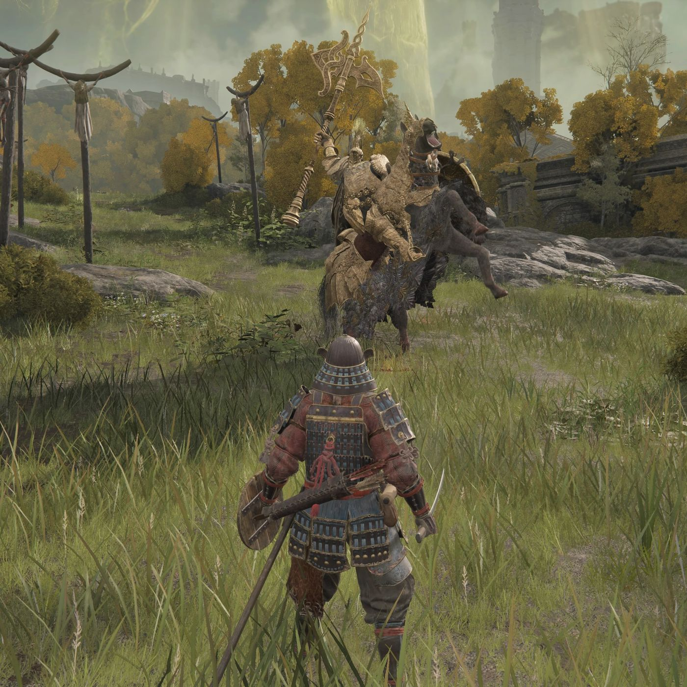

# AI Fights the Tree Sentinel

The goal of this project is to use reinforcement learning techniques to create a bot capable of defeating the first Tree Sentinel from Elden Ring.

## Description

The bot uses a custom OpenAI gym environment. The observation the bot gets for input is a 800x450 pixel image frame connected to a capture card capturing
the ELDEN RING gameplay. The bot engages in a loop started by returning to the grace site closests to the Tree Sentinel. From there the bot is manually
moved closer to the Tree Sentinel. Once the bot is in place the agent takes over and begins attempting to fight the Tree Sentinel. If the bot wanders
away and never interacts with the Tree Sentinel is is punished and automatically returns to the grace site after two minutes. The bot is punished for taking
damage and dying (dying is a better reward than wandering away and auto returing to grace). The bot is given a consistent rewarded based on the current hp
of the boss, this reward is increased linearly as the boss hp goes closer to 0. The bot also gets an instantanous reward for doing damage to the boss. The
bot is rewarded for finding the boss, and rewarded for staying alive while fighting the boss. 

## Lauch Elden Ring Offline
https://www.reddit.com/r/linux_gaming/comments/t0p7hq/fix_for_elden_ring_to_play_in_offline_mode/

# Watch it live

